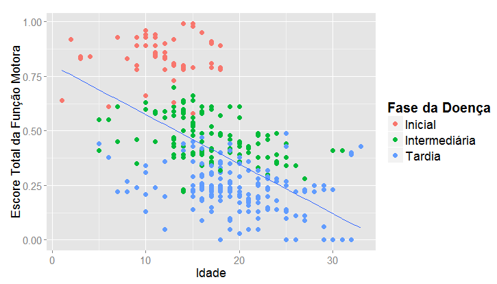

```{r setup, include=FALSE}
knitr::opts_chunk$set(echo = FALSE)

```


## Projeto

**Título**: "Análise da associação entre função motora e força muscular em pacientes com distrofia muscular de Duchenne: acompanhamento de 4 anos".

**Responsáveis**: Professor Alexandre Patriota, André Casagrandi e Daniel Falbel.

**Pesquisadora**: Milene Souza.

**Instituição**: Departamento de Fisioterapia, Fonoaudiologia e Terapia Ocupacional da Faculdade de Medicina da Universidade de São Paulo – FOFITO/USP.

**Ano**: 2014.

## Distrofia muscular

- Grupo de doenças musculares
    - hereditariedade e progressividade
    - rara
  
- Distrofia muscular de Duchenne: 1 a cada 3500 meninos nascidos vivos
    - Quedas frequentes, dificuldade para subir escada, correr, levantar do chão
    - Incapacidade de andar
    - Insuficiência respiratória, falta de força para tossir
    - Infecções respiratórias
    - Óbito
    
- Tratamento: manter capacidade muscular e aumentar a qualidade de vida
    - Corticoides e fisioterapia

## Distrofia muscular

- Tratamento x estágio da doença

- Instrumento de avaliação da evolução da doença
    - Escala vignos
    - Medição da força muscular - escala MRC (Medical Research Council)
    - A capacidade motora não é considerada
    - Escala MFM (Medida de Função Motora)

## Objetivos

1. Estudar a relação entre força muscular e função motora, num período de 4 anos;

2. Descrever a evolução da força muscular em função do tempo;

3. Descrever a evolução da função motora em função do tempo;

4. Investigar a relação da idade com a força muscular e função motora;

5. Analisar a relação entre força muscular, função motora e o tempo de evolução da doença.

## Estudo

- 47 pacientes do sexo masculino

- 8 e 30 anos

- 4 anos de observação, avaliações a cada 6 meses

- estudo longitudinal, observacional e retrospectivo

## Variáveis

- Idade (anos)

- Força muscular (MRC)
    - 48 grupos musculares
    - Escore 0 a 5 (força normal)
    - % = (soma dos escores)/(máximo escore possível) 

- Função motora (MFM)
    - 32 itens divididos em 3 domínios (em pé, axial e distal)
    - Escore 0 a 3 (realiza o item normalmente)
    - % = (soma dos escores)/(máximo escore possível)

- Evolução da doença (Vignos)
    - Fase inicial (anda): 0 a 6
    - Fase intermediária (cadeirante): 7
    - Fase tardia (cadeirante/BIPAP): 8 a 10

## Análise descritiva


## Análise descritiva


## Análise descritiva



## Análise descritiva


## Análise descritiva


## Análise descritiva


## Análise descritiva


## Análise descritiva


## Análise descritiva


## Análise descritiva


## Análise inferencial

- Modelo de regressão Beta 
    - força muscular x capacidade motora
    - variáveis não são independentes
    - máxima verossimilhança
    
\[
Y_{ij}|\mathbf{X_{ij}}, \gamma_i \sim Beta(\mu_{ij}, \phi_{ij})
\]

## Análise inferencial


## Conclusões

- A função motora e a força muscular diminuem com o tempo.

- A relação entre elas não parece mudar com o tempo.

- Há diferença na relação entre as variáveis para cada fase da doença e nos diferentes domínios da função motora.

- A função motora e a força diminuem com a idade.


