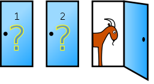

```{r, echo=FALSE, message=FALSE, warning=FALSE}
library(pander)
library(ggplot2)
library(dplyr)
library(magrittr)
library(lubridate)
library(vcd)
panderOptions("table.style", "rmarkdown")
```

## Conceitos básicos {.build}

<b>Experimento aleatório</b>: experimento cujo resultado não pode ser determinado de antemão.

<b>Espaço amostral</b> ou <b>população</b> $(\Omega)$: conjunto de todos os possíveis resultados de um experimento aleatório.

Um <b>evento</b> $A$ é qualquer sub-conjunto de $\Omega$. Dizemos que $A$ ocorreu se qualquer elemento de $A$ ocorreu.

## Propriedades importantes

1. A probabilidade é um número real no intervalo real [0,1].

2. $P(\Omega) = 1$ e $P(\emptyset) = 0$.

3. $P(A\cup B) = P(A) + P(B) - P(A\cap B)$


## Exemplos

Lançamento de uma moeda

Lançamento de duas moedas

Lançamento de um dado

Lançamento de dois dados

## Problema das portas {.flexbox .vcenter}

<div class="centered">

</div>

## Outros exemplos

- Mega-sena

- Aniversários

- Julgamento


