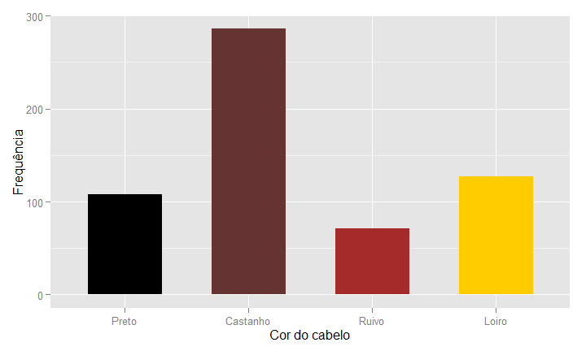
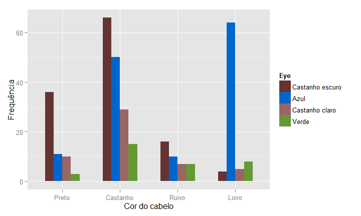
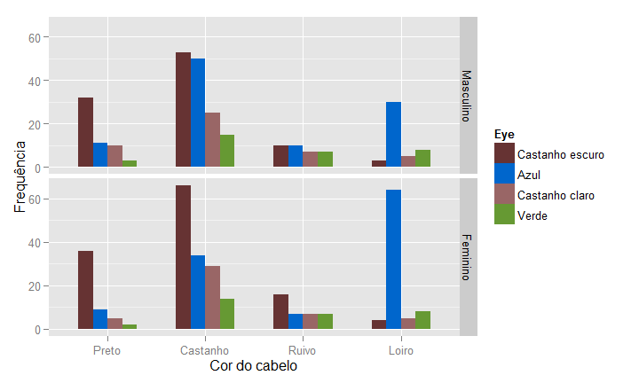
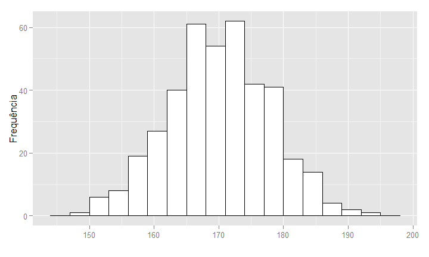
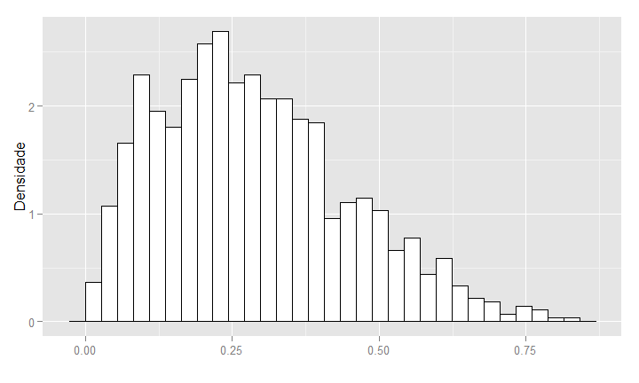
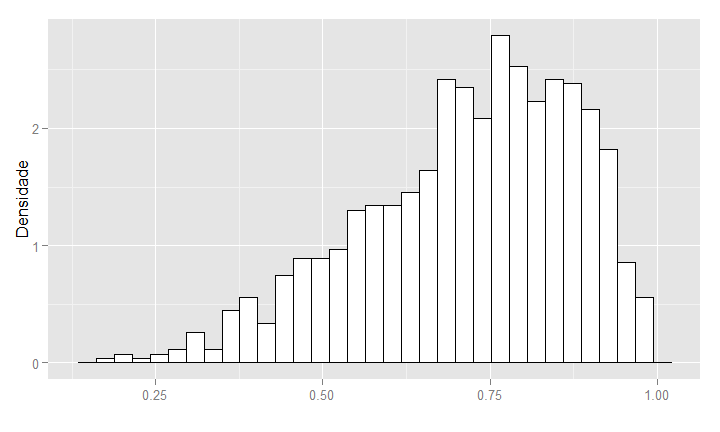

# Aula 3 - Gráficos
William Nilson de Amorim  
06/01/16  

## Introdução 

- Analisar um gráfico é uma maneira rápida e concisa de visualizar certas informações contidas em um conjunto de observações. 
- O gráfico certo a ser utilizado em cada situação depende da informação que queremos visualizar e do tipo de variável que estamos trabalhando.
- Um gráfico mal muitas vezes falha em trazer com clareza a informação que queremos visualizar e, em alguns casos, pode levar a falsas evidências.

## Gráfico de barras {.smaller}

Amostra: estudantes de estatística

X: cor do cabelo --- Y: cor dos olhos --- W: sexo

 

## Gráfico de barras 

Podemos associar a variável "cor dos olhos" à cor das barras do gráfico.

 

## Gráfico de barras

Além disso, podemos dividir o gráfico pela variável "sexo" e comparar as frequências para homens e mulheres.

 

## Histogramas

 

## Histogramas

 

## Histograma

Assimetria à direita

 

## Histogramas

Assimetria à esquerda

 
