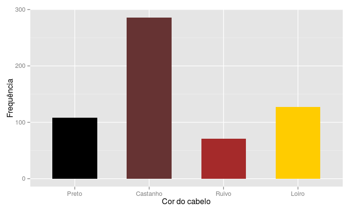

# Aula 3 - Gráficos
William Nilson de Amorim  
06/01/16  

## Introdução 

- Analisar um gráfico é uma maneira rápida e concisa de visualizar certas informações contidas em um conjunto de observações. 
- O gráfico certo a ser utilizado em cada situação depende da informação que queremos visualizar e do tipo de variável que estamos trabalhando.
- Um gráfico mal muitas vezes falha em trazer com clareza a informação que queremos visualizar e, em alguns casos, pode levar a falsas evidências.

## Gráficos de barras {.smaller}

Amostra: estudantes de estatística

X: cor do cabelo --- Y: cor dos olhos --- W: sexo

 

## Gráficos de barras 

Podemos associar a variável "cor dos olhos" à cor das barras do gráfico.

 

## Gráficos de barras

Além disso, podemos dividir o gráfico pela variável "sexo" e comparar as frequências para homens e mulheres.

 

## Histogramas

Amostra de tamanho 400 de uma distribuição normal com média 170 e desvio padrão 8.

 

## Histogramas {.smaller}

Em vez de representar a frequência no eixo y, podemos optar pela densidade, definida pela razão entre a proporção e a amplitude de cada classe. Um histograma construído dessa forma tem área 1.

 

## Histogramas

Assimetria à direita

 

## Histogramas

Assimetria à esquerda

 

## Boxplots

Dados da temporada de Baseball de 1986 (EUA)

 

## Boxplots

Dados da temporada de Baseball de 1986 (EUA)

 

## Gráficos de dispersão

 

## Gráficos de dispersão

 

## Gráfico de uma série

Vazão do rio Nilo de 1871 a 1970.

 

## Gráfico de uma série

Número de mortes acidentais nos EUA de 1973 a 1979.

 

## Gráficos mal construídos

 

## Gráficos mal construídos

 

## Gráficos mal construídos

 

## Gráficos mal construídos

 
